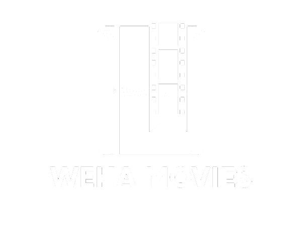

# Weka Movies - Next.js, Tailwind, Firebase, and TMDB API

Weka Movies is a web application designed to provide a seamless movie and TV show discovery experience. It leverages Next.js, Tailwind CSS, Firebase, and the TMDB API to offer users the ability to explore trending movies and TV shows, mark their favorites, and search for any desired content.

## Overview

Weka Movies is your go-to destination for discovering and managing your favorite movies and TV shows. With a sleek and user-friendly interface, this website leverages cutting-edge technologies to provide an immersive entertainment experience.

### Key Features

- **Trending Section**: The homepage showcases trending movies and TV shows fetched in real-time from the TMDB API, ensuring you stay up-to-date with the latest in entertainment.

- **Favorite Movies/TV Shows**: Create a personalized account and log in to mark your favorite movies and TV shows. Easily manage your preferences and revisit them whenever you like.

- **Search Functionality**: Looking for something specific? Utilize the powerful search bar to find any movie or TV show by name, ensuring you can access your desired content with ease.

Weka Movies is more than just a website; it's your gateway to an extensive world of entertainment, allowing you to explore, engage, and enjoy the world of cinema and television.

## Technology Stack

Weka Movies is built using a modern and robust technology stack:

- **Next.js**: A popular React framework for building server-rendered applications.

- **Tailwind CSS**: A utility-first CSS framework that makes styling efficient and maintainable.

- **Firebase**: A cloud-based platform that provides authentication, real-time database, and hosting services.

- **TMDB API**: The Movie Database API, which offers a rich source of movie and TV show data.

## Usage

1. Open your web browser and navigate to the Weka Movies website.

2. Browse through the trending section to discover popular movies and TV shows.

3. Create an account and log in to save your favorite movies and TV shows.

4. Use the search bar to find specific movies or TV shows by name.

5. Enjoy exploring and managing your favorite content!

## License

This project is licensed under the MIT License. See the [LICENSE](LICENSE) file for details.

---

Thank you for using Weka Movies! If you have any questions, feedback, or issues, please don't hesitate to [contact us](mailto:your-email@example.com).